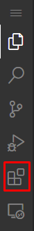
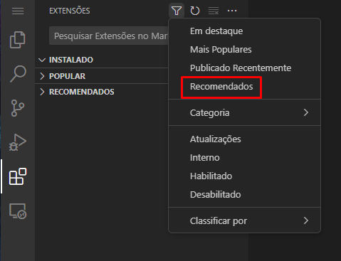
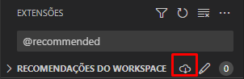

# Setup

Para instalar as extensões você deve ir na sua aba **Extensions (Ctrl + Shift + X)**

E em seguida usar o filtro _"recomendado"_

E então clicar em "Instalar Extensões Recomendadas do Workspace"

